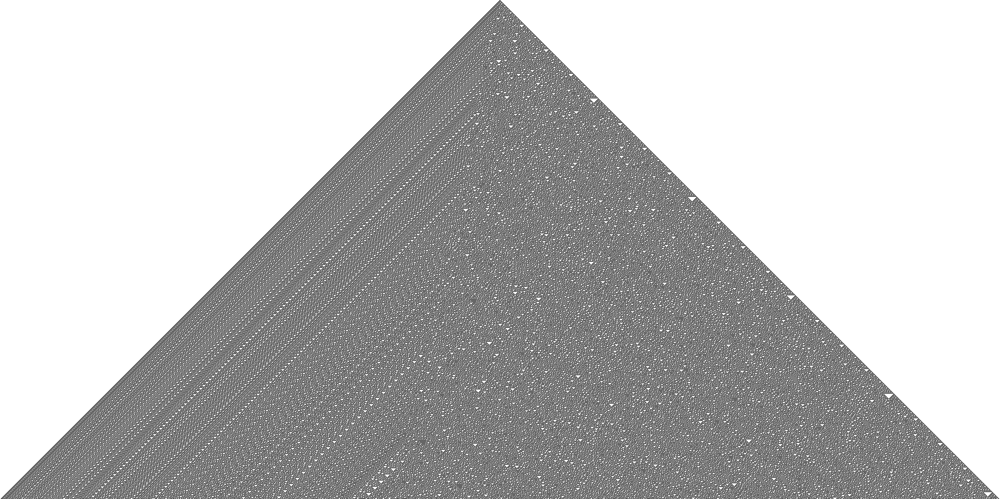

# Cellular automata

- [Introduction](#introduction)
- [Elementary cellular automata](#elementary-cellular-automata)
- [Random cellular automata](#random-cellular-automata)

## Introduction

Compile and execute:
```bash
 gcc elem_auto.c -o elem_auto.exe -lm
 ./elem_auto.exe
```

## Elementary cellular automata

Rule 30: 


Rule 126: 


Rule 150: 


Rule 182: 


## Random cellular automata

Rule 18: 


Rule 22: 


Rule 32: 


Rule 54: 


Rule 60: 


Rule 62: 


